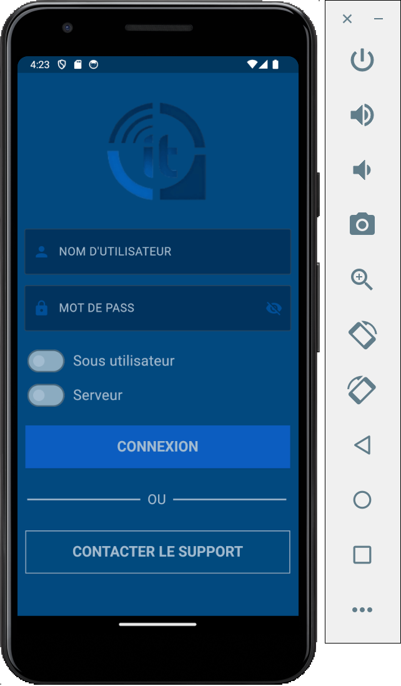
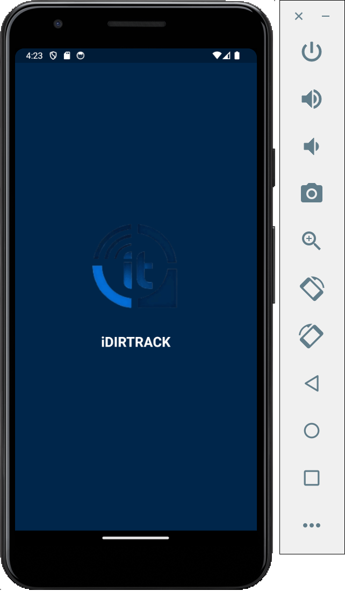

# Car Tracking App

Car Tracking App is a mobile application developed with Flutter that allows users to track their cars using GPS technology. The app provides functionalities for monitoring car speed, acceleration, and safety features like detecting open doors.

## Features

### 1. GPS Tracking
- Real-time tracking of the user's car using GPS technology.
- Displays the current location of the car on a map interface.

### 2. Speed Monitoring
- Monitors and displays the speed of the car in real-time.
- Users can set speed limits and receive alerts if the car exceeds the set speed limit.

### 3. Acceleration Monitoring
- Tracks the acceleration of the car and provides visual feedback on acceleration patterns.

### 4. Safety Features
- Detects and alerts users if any of the car doors are open while the car is in motion.
- Provides notifications for other safety-related events such as low battery, engine issues, etc.

## Screenshots

*Login Screen: Allows users to sign in to the app.*

*Splash Screen: Displays the app logo and initializes the app.*

## Usage

1. **Sign Up/Login**: Users need to sign up or log in to the app to access the tracking functionalities.
2. **Dashboard**: Upon logging in, users are presented with a dashboard displaying real-time car location, speed, and safety alerts.
3. **Settings**: Users can customize settings such as speed limits, notifications preferences, etc.
4. **History**: View historical data of car movements, including routes taken, speed, and safety alerts.

## How to Use

1. Clone the repository.
2. Open the project in your favorite IDE (e.g., Visual Studio Code).
3. Ensure Flutter and Dart SDK are installed on your system.
4. Run the app on your device or emulator using `flutter run`.

## Feedback

We welcome any feedback or suggestions for improving the Car Tracking App. Please feel free to [open an issue](https://github.com/yourusername/car-tracking-app/issues) if you encounter any problems or have ideas for new features.

## Contributors

- MarwnaeBoudouar (@Marwanenoudouar10)

## License

This project is licensed under the [MIT License](LICENSE).
